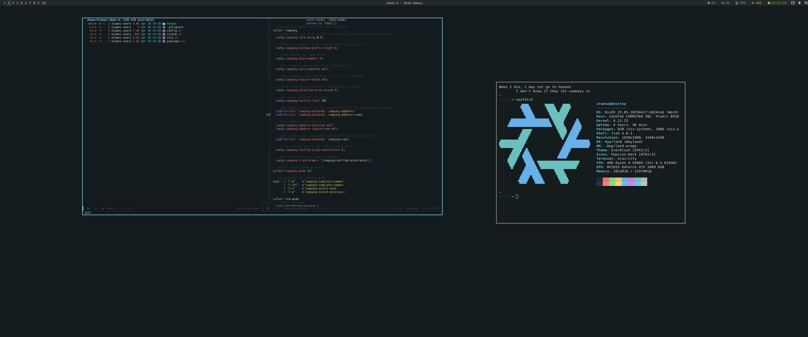

# [Hyprland] Everblush

## Details
- **OS**: NixOS Unstable
- **WM**: Hyprland
- **Terminal**: Alacritty / Kitty
- **Shell**: Fish + Bash (with Tidal prompt)
- **Editor**: Doom Emacs (`doom-everblush-theme`)
- **Bar**: Waybar
- **Launcher**: Wofi
- **File Manager**: PCManFM / Dolphin / Thunar
- **GTK Theme**: [Everblush GTK](https://github.com/Everblush/gtk)
- **Icons**: Papirus-Dark
- **Cursor**: macOS-BigSur
- **Font**: Dina (pixelsize=12, no antialiasing)
- **Notification**: Dunst
- **Screenshot Tool**: Grimblast
- **Audio**: pulsemixer + easyeffects

## Screenshot


## Features
- Declarative NixOS configuration with flakes
- Modular home-manager setup
- Custom Everblush color scheme across all applications
- Seamless Doom Emacs integration with native compilation
- Automatic theme consistency across GTK applications
- Custom waybar configuration with powerline styling

## Files Structure

```
nixos-config/
├── flake.nix                 # Main entry point for NixOS/Home-Manager configuration
├── modules/                  # Reusable modules for both system and home configuration
│   ├── home/                 # Home-Manager specific modules (user environment)
│   │   ├── browser/          # Browser configurations (Firefox)
│   │   ├── colors.nix        # Global color scheme definition for home modules
│   │   ├── desktop/          # Desktop environment configurations (Hyprland, waybar, dunst)
│   │   ├── editors/          # Editor configurations (Doom Emacs)
│   │   ├── shell/            # Shell configurations (bash, fish, tide)
│   │   └── terminal/         # Terminal emulator configurations (Alacritty, Kitty)
│   ├── system/               # NixOS system modules
│   │   ├── base.nix          # Base system configuration
│   │   ├── default.nix       # Entry point for system modules
│   │   ├── desktop.nix       # Desktop-related system configuration
│   │   └── networking.nix    # Network configuration
│   └── theme-colors.nix      # Central color definitions to avoid import problems
├── home/                     # User-specific Home-Manager configurations
│   └── stamno/               # Configuration for user "stamno"
│       ├── default.nix       # Main configuration file for user
│       ├── programs.nix      # User-specific program configurations
│       ├── theme.nix         # User-specific theming
│       └── theme/            # Theme-specific files
│           └── colors.nix    # Everblush color definitions
├── hosts/                    # Host-specific configurations
│   └── desktop/              # Configuration for the "desktop" machine
│       ├── default.nix       # Main configuration for this host
│       └── hardware.nix      # Hardware-specific configuration
└── pkgs/                     # Custom packages
    ├── doom-config/          # Packaged Doom Emacs configuration
    ├── everblush-gtk/        # Everblush GTK theme
    └── firefox-everblush-theme/ # Firefox Everblush theme
```


## Highlights
- **Doom Emacs**: Auto-configured with custom `doom-everblush-theme` and syncs from my [personal repo](https://github.com/stamnostomp/doom-d)
- **Performance**: Native Doom compilation, hardware-accelerated Wayland
- **Shell**: Fish with emacs vterm integration + custom nix-shell prompts

## Key Bindings
- `SUPER + Return`: Terminal
- `SUPER + Space`: App Launcher
- `SUPER + E`: Doom Emacs
- `SUPER + W`: Web Browser
- `SUPER + M`: File Manager
- `SUPER + P`: Audio Mixer
- `ALT + S`: Screenshot region

## Dotfiles

```nix
inputs.everblush-gtk.url = "github:Everblush/gtk";
```

Repo coming soon™️
